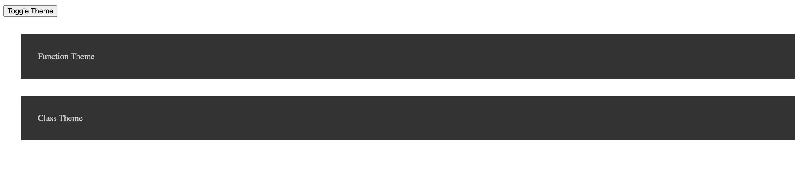

# Practice React UseContext

How To Use Context In React With Hooks

Link to Article: https://blog.webdevsimplified.com/2020-06/use-context/

## Learning

**Part 1:**

* Difference between ClassComponents and FunctionComponents
* Global state or props that need to be passed to deeply nested components.

**Part 2:**

* In App.js, ThemeProvider is wrapping all the logic for handling and updating state to the children
* ThemeProvider is handling creating the state, updating state and persisting both of the different values down to the children
* Two custom hooks that provide easy access to the different values (Theme value and updating Theme value)

## Images

Difference in ClassContextComponents and FunctionComponents

ClassContextComponents

FunctionContextComponents

App.js file

___

Part 2: Using Hooks

Added a ThemeContext, with two custom hooks

Cleaning up App.js file

Updating FunctionContextComponent to use hooks (useTheme, updateTheme)

---

This project was bootstrapped with [Create React App](https://github.com/facebook/create-react-app).

## Start Script

In the project directory, you can run:

### `npm start`

[http://localhost:3000]

